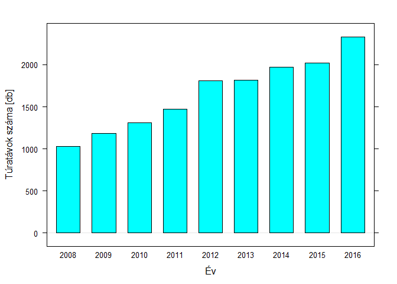

A magyar teljesítménytúra-naptár fejlődése, 2008-2016
================
Ferenci Tamás, <tamas.ferenci@medstat.hu>
2017. február 20.

-   [Cél](#cel)
-   [Számítástechnikai megjegyzések](#szamitastechnikai-megjegyzesek)
-   [Eredmények](#eredmenyek)
    -   [Túrák és túrázok száma](#turak-es-turazok-szama)
        -   [Túrák száma](#turak-szama)
        -   [Túratávok száma](#turatavok-szama)
        -   [Résztvevők száma](#resztvevok-szama)
    -   [Túrák, túratávok jellege](#turak-turatavok-jellege)
        -   [Résztávok száma](#resztavok-szama)
        -   [Résztvevők száma](#resztvevok-szama-1)
        -   [Táv](#tav)
        -   [Szint](#szint)
-   [Konklúziók](#konkluziok)

Cél
===

Jelen elemzés célja annak vizsgálata, hogy – a Teljesítménytúrázók Társaságának adatai alapján – hogyan változott, fejlődött a magyar teljesítménytúrák kínálata. Olyan szempontokat fogok vizsgálni, mint a túrák száma, a túratávok száma, a résztvevők száma, a túrák jellege és mindezek összefüggései. Az elérhető adatokból adódóan a vizsgálat a 2008-2016 időszakot fogja át.

Számítástechnikai megjegyzések
==============================

Az elemzéshez felhasznált adatok forrását a Teljesítménytúrázók Társaságának (<http://www.teljesitmenyturazoktarsasaga.hu/>) honlapján elérhető statisztikák jelentik: ezek 2008-tól évente tartalmazzák – számítógéppel jól feldolgozható formátumban – valamennyi túra és túratáv legfontosabb adatait.

Az adatok beolvasása meglehetősen egyértelmű feladat, csak pár dologra kell odafigyelni:

-   2013-ban és az előtt `xls` a formátum, utána `xlsx`.
-   2008-ban `M.` a megjegyzés rovat neve, utána `Megjegyzés`.
-   Minden túrának van egy önálló sora a táblában, *és* minden távjának külön-külön is. Elég ez utóbbit megtartani, hiszen azokból is vissza tudunk következtetni később minden, számunkra szükséges, túrára jellemző adatra.
-   Szerencsére a kerékpáros – illetve általában: nem gyalog- – túráknál ez a jelleg a megjegyzés rovatban is fel van tüntetve, így az előbbi szűrés után is meg tudjuk ezeket találni, hogy kizárjuk a vizsgálatból.
-   Az előbbi két pontot egybevetve: azokat a sorokat kell kiszűrni a táblázatból, ahol az `R.` értéke nem nulla (ezek a túratávok) és ahol a `Megjegyzés` üres (ezek a gyalogos túrák).
-   A dátum oszlop neve változik (mert mindig bele van írva az évszám).
-   Egy-két helyen nem szám szerepel az Indulók, illetve a Teljesítők oszlopban, ezt szintén szűrni kell.

Az elemzés `R` statisztikai környezet alatt készült, a vizualizáció `lattice` csomaggal, a jelentés pedig `knitr`-rel, `RMarkdown` formátumban. A kódot úgy írtam meg, hogy a lehető legáltalánosabb legyen (így például könnyen alkalmazható legyen más évekre is). A teljes forráskódot, és a reprodukálható jelentést közzétettem `Github`-on, a következő repozitóriumban: <https://github.com/tamas-ferenci/TTT_TuraStatisztika>.

A jelentés elérhető PDF formátumban a következő címen: <https://github.com/tamas-ferenci/TTT_TuraStatisztika/blob/master/TTT_TuraNaptarFejlodese_Report.pdf> (letölthető a jobb oldalt felül lévő Download feliratú gombbal).

Eredmények
==========

Túrák és túrázok száma
----------------------

### Túrák száma

A következő ábra mutatja a túrák számának változását (évente): 

Jól látszik a folyamatos, nagyjából állandó ütemű növekedés a túrák számában. Egyszerű lineáris modellel számolva azt mondhatjuk, hogy évente 54.2 a növekedés a túrák számában.

Mivel ismerjük a túrák pontos időpontját, így nem muszáj évente csoportosítanunk, lehetünk sokkal finomabb felbontásúak: nézzük meg hetente! 

Ez az ábra nehezen átlátható, hiszen érezhető, hogy nagyon erős az éven belüli, ismétlődő mintázat (a szezonalitás). Éppen ezért ábrázoljuk inkább úgy az adatokat, hogy a vízszintes tengelyen a túra megrendezésének hete van, és minden év külön görbét kap: 

Mivel az egyes évek nem egyszerűen külön kategóriák, hanem sorba vannak rendezve, így ezt a színezés is kifejezi: a színek is sorban jönnek – pirostól a zöldig – így abból is látható, hogyan haladunk előre az időben. A vastag kék vonal az összes év átlagát tünteti fel, mely még jobban vezeti a szemet a szezonális mintázatot illetően.

Világosan látható, hogy a túrák számának két, jól elkülönülő maximuma van: az egyik a 16-20. hét (május) között, a másik a 36-40. hét (október) környékén. A nyár közepe-vége, és a tél egyaránt kevésbé népszerű időszak túrarendezésre.

### Túratávok száma

A túratávok számának változását – éves bontásban – az alábbi ábra mutatja: 

Hasonló töretlen fejlődést figyelhetünk meg itt is; évente átlagosan 156.2 a növekedés a túrák számában.

A szezonális mintázat egészen hasonló a túrák számához: 

### Résztvevők száma

Résztvevők száma alatt most az indulók számát értem (a teljesítők számát – és így a teljesítők arányát – logikusabb a túra egyéb jellemzőivel, például a szintjével vagy a távjával összevetni, és nem az időpontjával, amitől kevésbé logikus, hogy függjön, így ezt a kérdést máshol fogom vizsgálni).

Így néz ki az indulók száma éves bontásban:  A fejlődés összességében itt is látható, ám jóval kevésbé töretlen mint a túrák vagy távok számát tekintve.

A szezonális mintázat:  Érdekes, hogy a ,,kétpúpú’’ mintázat itt is pontosan ugyanúgy megjelenik, ám eltérő súllyal: a májusi csúcs jóval több túrázót vonz mint az őszi. Megfigyelhető még egy, jóval kisebb csúcs január végén is. (A nyilvánvaló magyarázat, hogy egyes népszerű túrákat mindig az év ugyanazon vagy hasonló időpontjában rendezik meg, amik a túrák számát lehet, hogy csak 1-gyel növelik, de a résztvevők számát nagyon is sokkal.)

Túrák, túratávok jellege
------------------------

### Résztávok száma

A következő ábra mutatja a túrák számának változását résztávjaik száma szerint: 

Érdekesebb kérdés most számunkra az *összetétel* alakulása, azaz, hogy a megoszlás hogyan változott: 

Jól látszik, hogy a résztáv szerint összetétel meglehetősen stabil maradt a teljes vizsgált időszakban.

### Résztvevők száma

A túratávok számának változása az indulók száma szerint (kategorizálva ezt):  (Az oszlopok magassága azért nem egyezik a túratávok számánál látottal, mert nem minden túratávra volt megadva az indulók száma – ezek itt értelemszerűen hiányoznak, de abban a kimutatásban szerepeltek.)

Megint csak az összetétel az érdekesebb most számunkra: 

Itt is megállapíthatjuk, hogy a túrák jellege ebből a szempontból is állandó maradt az évek alatt.

A fenti ábrákkal szemben felhozható az a kifogás, hogy a résztvevők számát – ami a valóságban egy folytonos változó – kategorizáltuk, ami információvesztéssel jár. Helyesebb tehát, ha boxplot-ot használunk (az áttekinthetőség kedvéért a függőleges tengelyen logaritmikus skálázással):  Látható, hogy a konklúzió ugyanaz (a továbbiakban, a közérthetőség miatt, inkább az előbbi típusú ábrázolást fogom használni).

### Táv

A túratávok megoszlása távjuk szerint: 

A megoszlásuk: 

Összességében itt is az látszik, hogy a túrák jellege meglehetősen stabil maradt az évek alatt, bár egy enyhe előretörése a rövidebb távú túráknak azért érzékelhető.

### Szint

A túratávok megoszlása szintjük szerint: 

A megoszlásuk: 

Itt – ismét csak – meglehetősen stabil összetételt látunk.

Konklúziók
==========

A magyar teljesítménytúra-naptár dinamikus fejlődésen ment át az elmúlt szűk 10 évben. Mind a túrák száma, mind a távok száma jelentős mértékben és szinte töretlenül fejlődött (2008 és 2016 között mindkettő több mint kétszeresére nőtt!). A résztvevők száma is lényegesen emelkedett, bár az előbbitől elmaradó mértékben (mintegy 50%-kal ez alatt az időszak alatt, évi 80 ezerről 120 ezerre).

A túrák megrendezési időpontjának éven belüli eloszlásának mintázata rendkívül állandó: két kiemelkedő csúcs tapasztalható, az első május, a második október környékén. A résztvevők száma esetében a második csúcs nem annyira kifejezett, illetve megjelenik egy harmadik is, január legvégén (a népszerű, sok túrázót megmozgató túrák hatására).

Érdekes, hogy a túrák, illetve túratávok összetétele – akár résztávok száma szerint, akár indulók száma szerint, akár táv vagy szint szerinti megoszlását nézzük – stabil a majdnem egy évtized változásainak ellenére. Egyedül a rövidebb távú túrák arányának enyhe emelkedése érzékelhető.
