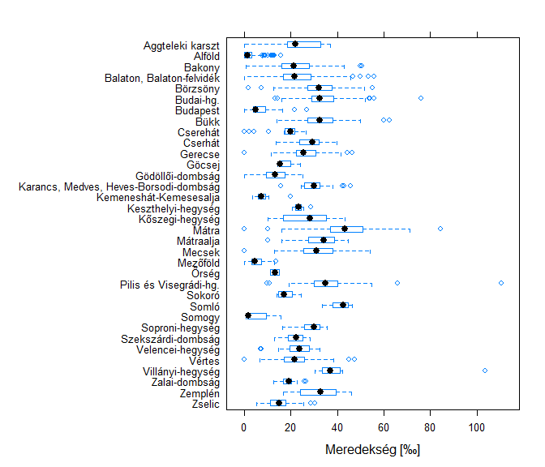

A 2016-os magyar teljesítménytúrák adatainak elemzése
================
Ferenci Tamás, <tamas.ferenci@medstat.hu>
2017. február 12.

Bevezető gondolatok és számítástechnikai megjegyzések
-----------------------------------------------------

A magyar teljesítménytúrák adatainak elemzése nem nehéz feladat, ugyanis a Teljesítménytúrázók Társasága (<http://www.teljesitmenyturazoktarsasaga.hu/>) van olyan kedves és minden évben egy – számítógéppel is jól feldolgozható – Excel-táblában összefoglalja a túrák összes fontos adatát. Ezek közül most hármat fogok felhasználni: a távot, a szintet (össz-szintemelkedés) és a túra tájegységét (hegységét).

Az egyetlen ,,számítástechnikai’’ nehézség a túra tájegységének meghatározása: sajnos az Excel-tábla (nem tudom milyen oknál fogva, de ilyen szempontból nagyon peches módon) egyetlen dolgot nem tartalmaz, a tájegységet. A probléma megoldását az tette lehetővé, hogy az online túranaptár viszont megadja minden túrához a hegységet, és szerencsére az ott szereplő túranév pontosan ugyanaz, mint ami az Excel-táblában is megjelenik. Ilyen módon, számítógéppel letöltve a túranaptárat, össze tudtam kapcsolni a túrákat a tájegységekkel (is).

A távnál és a szintnél csak azokat az értékeket fogadtam el, melyek értelmes számot tartalmaztak, így azok a túratávok, ahol például az intervallum jellegű megadás (,,20-25 km’‘) vagy pontatlan érték (,,kb. 15 km’’) szerepelt, nem jelennek meg a mostani elemzésekben. A tájegységek kapcsán egy definíciós problémába futottam: bizonyos túrákhoz több hegység is fel van sorolva, mert a túra útvonala mindent érinti, így adódik a kérdés, hogy ezeket a túrákat melyik hegységhez soroljam az elemzésekben? Jobb híján úgy döntöttem, hogy ilyen esetekben a túrát *mindegyik* tájegységhez hozzárendelem. (Így egy túra többször is megjelenik az ilyen elemzésekben; annyiszor, ahány hegységet érint.) Ennek a módszernek nyilvánvaló hátránya ez a többszöröződés, ám jobbat nem tudtam tenni.

Az elemzésből kizártam azokat a túratávokat, amelyek nem voltak gyalogosan teljesíthetőek (a jellegben nem szerepelt a ,,Gy’’ betű), amelyekhez nem volt tájegység, táv vagy szint (ez utóbbi kettő a fenti értelemben) megadva, amelyiknél a megadott táv 0 méter volt, és azokat, amelyek külföldön zajlottak, akár csak részben is, tehát külföldi helyszín[1] is szerepelt a tájegységek között.

Az elemzés `R` statisztikai környezet alatt készült, a vizualizáció `lattice` csomaggal, a jelentés pedig `knitr`-rel, `RMarkdown` formátumban. A kódot úgy írtam meg, hogy a lehető legáltalánosabb legyen (így például könnyen alkalmazható legyen más évekre is). A teljes forráskódot, és a reprodukálható jelentést közzétettem `Github`-on, a következő repozitóriumban: <https://github.com/tamas-ferenci/TTT_TuraStatisztika>.

A jelentés elérhető PDF formátumban a következő címen: <https://github.com/tamas-ferenci/TTT_TuraStatisztika/blob/master/TTT_TuraStatisztika_Report.pdf> (letölthető a jobb oldalt felül lévő Download feliratú gombbal).

Táv, szint- és hegységadatok egyváltozós elemzése
-------------------------------------------------

Az adatbázis eredetileg 2452 túratávot tartalmaz. Ebből a nem gyalogos túratávokat kizárva marad 2166, a hegység nélkülieket és külföldieket kizárva 1780, táv vagy szint nélkülieket és 0 távúakat kizárva pedig 1766.

A túrák megoszlását tájegység szerint – egyelőre még a bevezetőben írt összevonás nélkül – a következő ábra mutatja:

Jól látszik a rengeteg, több tájon áthaladó túra (és ebből adódóan a nagyon kis számok). Áttekinthetőbb képet kapunk a bevezetőben vázolt összevonás után:

A túratávok hosszainak eloszlását a következő ábra mutatja (hisztogramon). Mivel van egy-két extrém hosszú túratáv, melyek miatt a legtöbb túrát tartalmazó régió elég kicsire össze lenne nyomva, így a jobb oldalon külön látható a 100 km-nél rövidebb túratávokra az eloszlás:

Konkrétan kiemelve, számszerűen a legrövidebb túratávok:

<table style="width:100%;">
<colgroup>
<col width="28%" />
<col width="8%" />
<col width="11%" />
<col width="12%" />
<col width="13%" />
<col width="25%" />
</colgroup>
<thead>
<tr class="header">
<th align="center">Túra neve</th>
<th align="center">Dátum</th>
<th align="center">Táv [km]</th>
<th align="center">Szint [m]</th>
<th align="center">Mered. [‰]</th>
<th align="center">Hegység</th>
</tr>
</thead>
<tbody>
<tr class="odd">
<td align="center">Óbudavár 0,1 Éjjel</td>
<td align="center">03. 19.</td>
<td align="center">0,1</td>
<td align="center">5</td>
<td align="center">50</td>
<td align="center">Balaton, Balaton-felvidék</td>
</tr>
<tr class="even">
<td align="center">Óbudavár 0,1 - A legeslegrövidebb túra</td>
<td align="center">05. 08.</td>
<td align="center">0,1</td>
<td align="center">5</td>
<td align="center">50</td>
<td align="center">Balaton, Balaton-felvidék Bakony</td>
</tr>
<tr class="odd">
<td align="center">Decathlon Mátra Túra - Törp túra 1</td>
<td align="center">04. 02.</td>
<td align="center">1</td>
<td align="center">0</td>
<td align="center">0</td>
<td align="center">Mátra</td>
</tr>
<tr class="even">
<td align="center">Kálvária Kör</td>
<td align="center">04. 02.</td>
<td align="center">1,16</td>
<td align="center">120</td>
<td align="center">103</td>
<td align="center">Villányi-hegység</td>
</tr>
<tr class="odd">
<td align="center">Óbudavár 1</td>
<td align="center">05. 08.</td>
<td align="center">1,5</td>
<td align="center">40</td>
<td align="center">27</td>
<td align="center">Balaton, Balaton-felvidék Bakony</td>
</tr>
</tbody>
</table>

És a leghosszabbak:

<table>
<colgroup>
<col width="32%" />
<col width="8%" />
<col width="11%" />
<col width="13%" />
<col width="14%" />
<col width="19%" />
</colgroup>
<thead>
<tr class="header">
<th align="center">Túra neve</th>
<th align="center">Dátum</th>
<th align="center">Táv [km]</th>
<th align="center">Szint [m]</th>
<th align="center">Mered. [‰]</th>
<th align="center">Hegység</th>
</tr>
</thead>
<tbody>
<tr class="odd">
<td align="center">Mecseki Mátrix 130</td>
<td align="center">04. 16.</td>
<td align="center">135</td>
<td align="center">3570</td>
<td align="center">26</td>
<td align="center">Mecsek</td>
</tr>
<tr class="even">
<td align="center">Galyavár 140</td>
<td align="center">11. 25.</td>
<td align="center">140,22</td>
<td align="center">9120</td>
<td align="center">65</td>
<td align="center">Mátra</td>
</tr>
<tr class="odd">
<td align="center">3x50</td>
<td align="center">10. 21.</td>
<td align="center">153,9</td>
<td align="center">4996</td>
<td align="center">32</td>
<td align="center">Budai-hg. Pilis és Visegrádi-hg.</td>
</tr>
<tr class="even">
<td align="center">Vadrózsa 160</td>
<td align="center">09. 10.</td>
<td align="center">165,48</td>
<td align="center">6277</td>
<td align="center">38</td>
<td align="center">Mátraalja Mátra</td>
</tr>
<tr class="odd">
<td align="center">Galyavár 110 mérföld (177 km)</td>
<td align="center">11. 25.</td>
<td align="center">177,12</td>
<td align="center">11520</td>
<td align="center">65</td>
<td align="center">Mátra</td>
</tr>
</tbody>
</table>

A túratávok szintjeinek eloszlása, hasonlóan jobb oldalon csak a 3000 méternél kisebb szintemelkedésű túratávok eloszlása ábrázolva:

A legnagyobb szintemelkedésű túratávok (a legalacsonyabbakat nincs értelme kitáblázni, hiszen több tucat van, aminél ez nulla):

<table>
<colgroup>
<col width="33%" />
<col width="8%" />
<col width="12%" />
<col width="13%" />
<col width="14%" />
<col width="16%" />
</colgroup>
<thead>
<tr class="header">
<th align="center">Túra neve</th>
<th align="center">Dátum</th>
<th align="center">Táv [km]</th>
<th align="center">Szint [m]</th>
<th align="center">Mered. [‰]</th>
<th align="center">Hegység</th>
</tr>
</thead>
<tbody>
<tr class="odd">
<td align="center">Mátra 115</td>
<td align="center">06. 04.</td>
<td align="center">121,02</td>
<td align="center">6020</td>
<td align="center">50</td>
<td align="center">Mátra</td>
</tr>
<tr class="even">
<td align="center">Vadrózsa 160</td>
<td align="center">09. 10.</td>
<td align="center">165,48</td>
<td align="center">6277</td>
<td align="center">38</td>
<td align="center">Mátraalja Mátra</td>
</tr>
<tr class="odd">
<td align="center">Galyavár 110</td>
<td align="center">11. 25.</td>
<td align="center">110,7</td>
<td align="center">7200</td>
<td align="center">65</td>
<td align="center">Mátra</td>
</tr>
<tr class="even">
<td align="center">Galyavár 140</td>
<td align="center">11. 25.</td>
<td align="center">140,22</td>
<td align="center">9120</td>
<td align="center">65</td>
<td align="center">Mátra</td>
</tr>
<tr class="odd">
<td align="center">Galyavár 110 mérföld (177 km)</td>
<td align="center">11. 25.</td>
<td align="center">177,12</td>
<td align="center">11520</td>
<td align="center">65</td>
<td align="center">Mátra</td>
</tr>
</tbody>
</table>

Táv- és szintadatok együttes elemzése
-------------------------------------

Érdekes kérdés annak vizsgálata, hogy a táv és a szintemelkedés hogyan oszlik meg, ha *együtt* vizsgáljuk őket, nem külön-külön, tehát ha egyszerre vesszük figyelembe, hogy mennyi egy túratáv távja *és* szintje. Annál is inkább, mert ezek nagyon természetesen adnak egy új paramétert (figyelmes szemlélő már az előbbi táblázatokban is észrevehette őket): a túratáv meredekségét, ami a szint és a táv hányadosa. (Ha az előbbit méterben mérjük, utóbbit kilométerben, akkor a meredekséget ezrelékben (‰) kapjuk meg.) Ez ilyen formában egyfajta ,,átlagos’’ meredekség, ami messze nem tökéletes mutató, hiszen a valóságban az is számít ugyancsak, hogy az emelkedések hogyan oszlanak meg a túra útvonalán, de ezekből az adatokból ez a legjobb, amit ki tudunk számolni.

A táv- és szintadatok egy kézenfekvő ábrázolása a szóródási diagram: minden pont egy túratáv, a vízszintes koordinátája a távja, a függőleges a szintje. Íme ez a 2016-os magyar teljesítménytúra-naptárra (az áttekinthetőség kedvéért a korábban használt 100 km-es és 3000 méteres szűkítéssel):

Az ábra egy további extrát is tartalmaz: mivel a szint és a táv meghatározza a meredekséget, így ez a fenti síkban is feltüntethető. Ez az ábra meg is teszi ezt: halvány vonalak jelzik az adott meredekséghez tartozó táv–szint kombinációkat (a végén feltüntetve a meredekség számszerű értékét is). Ilyen módon az ábrán nem csak a táv és a szint, de a meredekség is érzékelhető.

A rend kedvéért azért nézzük meg a meredekségnek is az eloszlását:

A legmeredekebb túratávok (a legkevésbé meredekek ezúttal sem túl érdekesek):

<table style="width:100%;">
<colgroup>
<col width="31%" />
<col width="8%" />
<col width="11%" />
<col width="12%" />
<col width="13%" />
<col width="22%" />
</colgroup>
<thead>
<tr class="header">
<th align="center">Túra neve</th>
<th align="center">Dátum</th>
<th align="center">Táv [km]</th>
<th align="center">Szint [m]</th>
<th align="center">Mered. [‰]</th>
<th align="center">Hegység</th>
</tr>
</thead>
<tbody>
<tr class="odd">
<td align="center">Európai sporthét 2016 - Esti sétatúra</td>
<td align="center">09. 14.</td>
<td align="center">2,1</td>
<td align="center">160</td>
<td align="center">76</td>
<td align="center">Budai-hg.</td>
</tr>
<tr class="even">
<td align="center">Nyikom-csúcsfutás</td>
<td align="center">04. 10.</td>
<td align="center">7,1</td>
<td align="center">600</td>
<td align="center">85</td>
<td align="center">Mátra</td>
</tr>
<tr class="odd">
<td align="center">Nyikom-csúcs túra és vetélkedő</td>
<td align="center">04. 10.</td>
<td align="center">7,1</td>
<td align="center">600</td>
<td align="center">85</td>
<td align="center">Mátra</td>
</tr>
<tr class="even">
<td align="center">Kálvária Kör</td>
<td align="center">04. 02.</td>
<td align="center">1,16</td>
<td align="center">120</td>
<td align="center">103</td>
<td align="center">Villányi-hegység</td>
</tr>
<tr class="odd">
<td align="center">Őszi Hazajáró 1,6km vezetett túra</td>
<td align="center">10. 30.</td>
<td align="center">1,6</td>
<td align="center">177</td>
<td align="center">111</td>
<td align="center">Pilis és Visegrádi-hg.</td>
</tr>
</tbody>
</table>

Látható, hogy ezek jórészt igen rövid túrák, így jöhetett ki az extrém meredekség, ezért érdekes lehet megnézni a legmeredekebb túrákat csak azon túratávok körében, melyek legalább 10 km hosszúak:

<table style="width:100%;">
<colgroup>
<col width="31%" />
<col width="8%" />
<col width="11%" />
<col width="12%" />
<col width="13%" />
<col width="22%" />
</colgroup>
<thead>
<tr class="header">
<th align="center">Túra neve</th>
<th align="center">Dátum</th>
<th align="center">Táv [km]</th>
<th align="center">Szint [m]</th>
<th align="center">Mered. [‰]</th>
<th align="center">Hegység</th>
</tr>
</thead>
<tbody>
<tr class="odd">
<td align="center">Kékes 2x</td>
<td align="center">08. 06.</td>
<td align="center">20,1</td>
<td align="center">1227</td>
<td align="center">61</td>
<td align="center">Mátra</td>
</tr>
<tr class="even">
<td align="center">Bükk 900-as csúcsai</td>
<td align="center">07. 30.</td>
<td align="center">32</td>
<td align="center">2000</td>
<td align="center">62</td>
<td align="center">Bükk</td>
</tr>
<tr class="odd">
<td align="center">Galyavár Félmaraton</td>
<td align="center">11. 26.</td>
<td align="center">22,14</td>
<td align="center">1440</td>
<td align="center">65</td>
<td align="center">Mátra</td>
</tr>
<tr class="even">
<td align="center">Galyavár 110 mérföld (177 km)</td>
<td align="center">11. 25.</td>
<td align="center">177,12</td>
<td align="center">11520</td>
<td align="center">65</td>
<td align="center">Mátra</td>
</tr>
<tr class="odd">
<td align="center">Galyavár 110</td>
<td align="center">11. 25.</td>
<td align="center">110,7</td>
<td align="center">7200</td>
<td align="center">65</td>
<td align="center">Mátra</td>
</tr>
<tr class="even">
<td align="center">Galyavár 80</td>
<td align="center">11. 26.</td>
<td align="center">81,18</td>
<td align="center">5280</td>
<td align="center">65</td>
<td align="center">Mátra</td>
</tr>
<tr class="odd">
<td align="center">Galyavár Maraton</td>
<td align="center">11. 26.</td>
<td align="center">44,28</td>
<td align="center">2880</td>
<td align="center">65</td>
<td align="center">Mátra</td>
</tr>
<tr class="even">
<td align="center">Galyavár 60</td>
<td align="center">11. 26.</td>
<td align="center">59,04</td>
<td align="center">3840</td>
<td align="center">65</td>
<td align="center">Mátra</td>
</tr>
<tr class="odd">
<td align="center">Galyavár 140</td>
<td align="center">11. 25.</td>
<td align="center">140,22</td>
<td align="center">9120</td>
<td align="center">65</td>
<td align="center">Mátra</td>
</tr>
<tr class="even">
<td align="center">Dr. Téry Ödön nehéz teljesítménytúra</td>
<td align="center">11. 19.</td>
<td align="center">11,7</td>
<td align="center">770</td>
<td align="center">66</td>
<td align="center">Pilis és Visegrádi-hg.</td>
</tr>
</tbody>
</table>

A tájegység bevonása az elemzésbe
---------------------------------

Egészítsük ki most a fenti elemzéseket a tájegységgel! A táv és szint együttes elemzésének megbontása még hegység szerint is áttekinthetetlen lenne, ezért vizsgáljuk őket külön-külön.

A teljesítménytúrák távjainak eloszlása, tájegység szerint (boxplottal[2] ábrázolva, ezúttal is 100 km-re szűkítve az ábrát):

A túratávok szintemelkedéseinek eloszlása boxploton, tájegység szerint (itt is 3000 méterre szűkítve az ábrát):

A meredekségek eloszlása pedig:

Mindhárom tényező együttes elemzése
-----------------------------------

Mint az előbb is említettem, a táv- és szintadatok együttes eloszlása eleve több mint ezer adatot jelent, ha ezeket még a több tucatnyi tájegység szerint is megbontjuk, az teljesen áttekinthetetlen lenne.

Éppen ezért a következőkben egy új trükköt alkalmazok: nem az egyes túrákat ábrázolom, hanem a hegységenkénti átlagokat! Azaz minden hegységre kiszámolom, hogy az adott hegységet érintő túráknak mennyi a közepes hossza és a közepes szintje, és ezeket ábrázolom (a már megszokott formában, szóródási diagramként, feltüntetve a meredekségeket is). Hogy az esetleges nagyon kilógó értékű túrák ne húzzák el az átlagot, középértékként inkább a mediánt használjuk:

[1] A következő tájegységek voltak a külföldiek: Ausztria, Bihar-hegység, Csehország, Erdély, Horvátország, Lengyelország, Németország, Románia, Szerbia, Szlovákia, Szlovénia, Ukrajna (Kárpátalja).

[2] A boxploton az adatok eloszlását egy – közepén pöttyöt tartalmazó – doboz, és az abból kinyúló antennák adják meg. Az értelmezéséhez azt kell tudni, hogy a pötty az adatok felezőpontjánál van (tehát annál az értéknél, amire igaz, hogy az adatok fele kisebb nála, fele nagyobb), ezt szokás mediánnak nevezni, a doboz alja és teteje pedig az alsó és felső negyedelőpontnál (aminél az adatok negyede kisebb és háromnegyede nagyobb, illetve háromnegyede kisebb, negyede nagyobb), ezt hívják alsó és felső kvartilisnek. Például a Mátránál a doboz alja 17,8 km-nél, a teteje 46,8 km-nél, a pötty pedig 29,9 km-nél van; ez azt jelenti, hogy a mátrai túrák negyede rövidebb 17,8 km-nél, háromnegyedük hosszabb ennél, a túrák fele rövidebb 29,9 km-nél, felük hosszabb, végül háromnegyedük rövidebb 46,8 km-nél, és csak negyedük hosszabb ennél is. Ilyen módon a boxplot jól érzékelhetővé teszi, hogy milyenek egy adott hegységben az ,,átlagos’‘hosszak (minél jobbrább van a pötty, annál hosszabbak a túrák), és azt is, hogy ebben mennyi a szóródás (minél szélesebb a doboz, annál nagyobb). A dobozból kinyúló antennák a nagyon kilógó értékek nélküli minimumot és maximumot jelzik, az antennákon túli egyes karikák pedig ezeket a nagyon eltérő értéket mutató túrákat (a ,,nagyon kilógás’’ egy bevett statisztikai definícióját használva).
